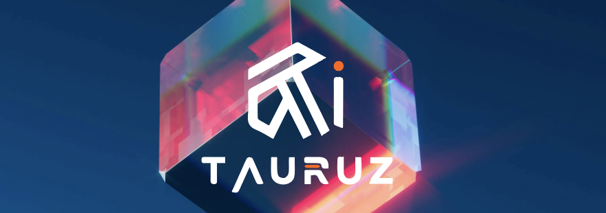

<p align="center">
  
</p>

# 🎬 AI for Audiovisuals

Welcome to **AI for Audiovisuals** – a creative pipeline powered by AI that helps you go from **script ➡️ image ➡️ video** with just a few lines of code!  
This project uses powerful APIs like **OpenAI**, **DALL·E**, and **Runway ML** to generate original audiovisual content.

---

## 📁 Project Structure

This project is made up of **3 Python files**, each handling a specific part of the creative process:

### 1. `create-script.py` ✍️  
- **Purpose**: Generate a film or play script using the **OpenAI API**.
- **What it does**: Takes a prompt or theme and returns a creative, AI-generated script.
- **Tech used**: `openai` (GPT)

---

### 2. `create-image.py` 🖼  
- **Purpose**: Turn your script or scene description into an image using the **DALL·E API**.
- **What it does**: Sends a prompt to DALL·E and returns a generated image.
- **Tech used**: `openai` (DALL·E)

---

### 3. `create-video.py` 🎥  
- **Purpose**: Create a video based on the generated image using the **Runway ML API**.
- **What it does**: Uploads an image, applies a video model (e.g., motion effects), and returns a video file.
- **Tech used**: `runwayml` (Runway ML)

---

## 🚀 Getting Started

### 🔧 Prerequisites
- Python 3.8+
- API keys for:
  - [OpenAI](https://platform.openai.com/)
  - [Runway ML](https://runwayml.com/)

### 📦 Install Dependencies
```python
pip install openai runwayml
```

## 🧪 Example Workflow
Generate a script for a play or a film

```python
python create-script.py
```


Create an image from your script
```python
python create-image.py
```

Generate a video from the image

```
python create-video.py
```


## 📌 Notes
Be sure to keep your API keys safe. Use .env files or environment variables.

Output files are saved locally. Check each script's output section for paths and filenames.

❤️ Support This Project
If you like this project and want to support future development, you can <a target="_blank" href="https://buymeacoffee.com/tauruzai">Buy Me a Coffee ☕.</a>

📜 License
This project is open-source under the MIT License.